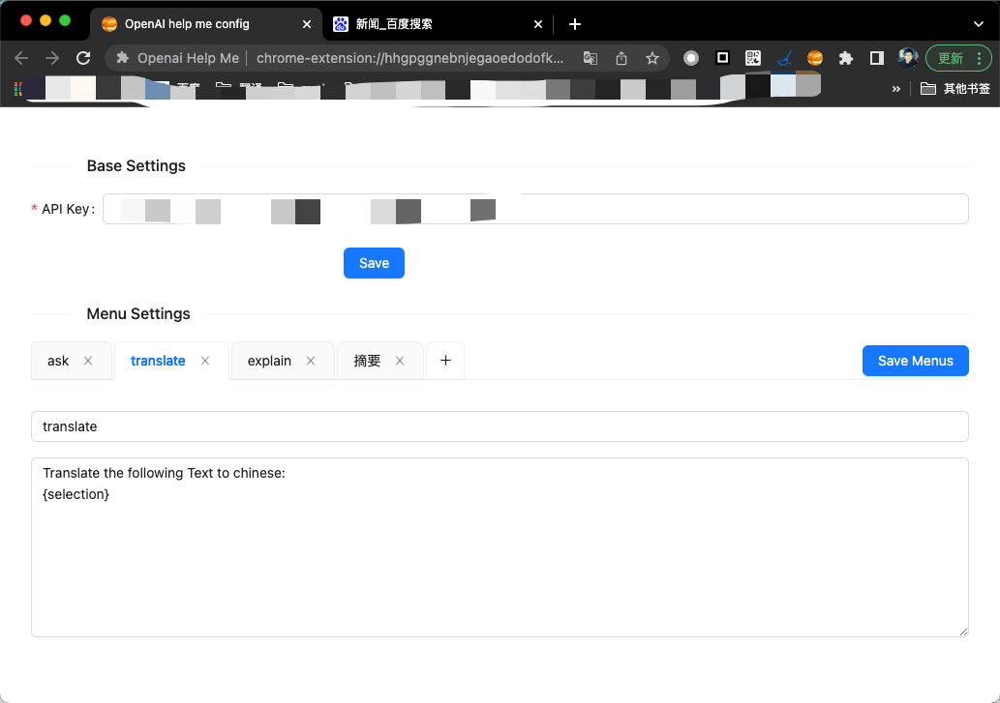
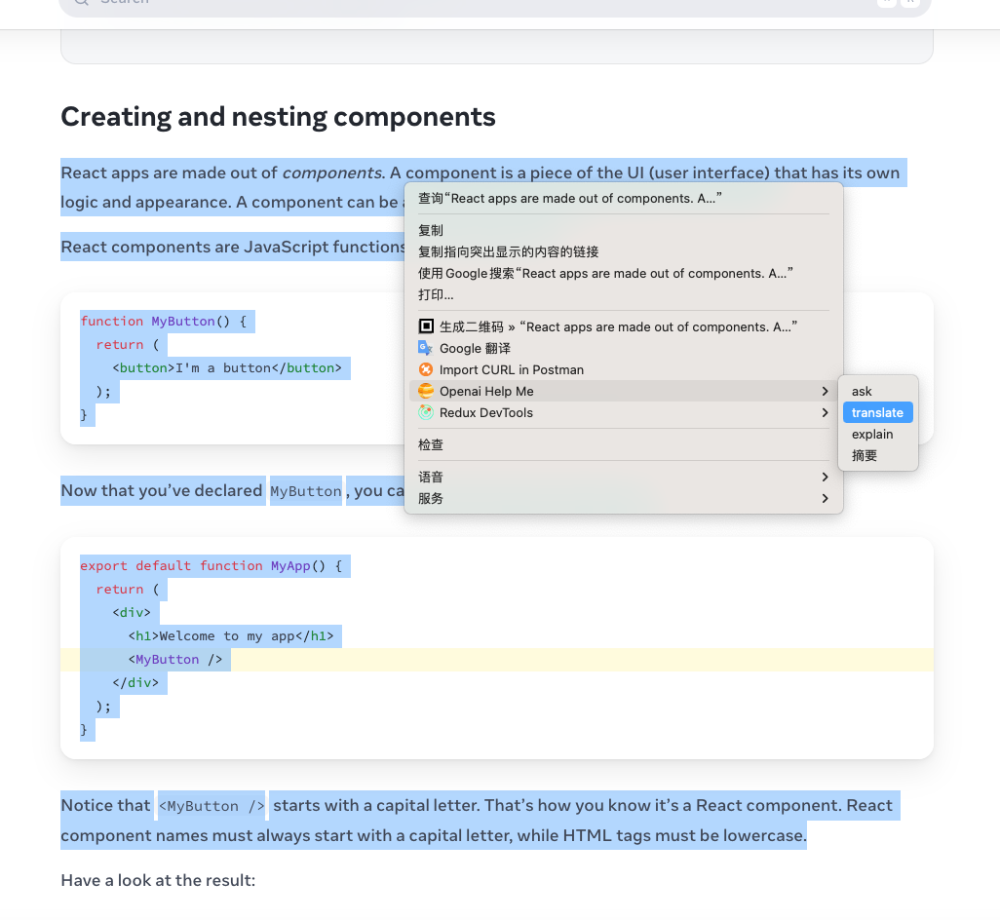
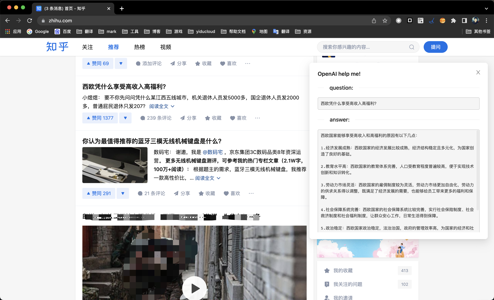

#  Openai Help Me

A chrome extension for open AI

## build

```sh
pnpm i
```

and

```sh
pnpm run build
```

## todo

1. 支持 copy 按钮（现在因为拖放不能选中结果内容）
2. 支持自定义菜单和对应的 question
3. 支持对话

## usage

1. Enter API Key
   

2. Select text and popup menus
   

3. Get answer
   
